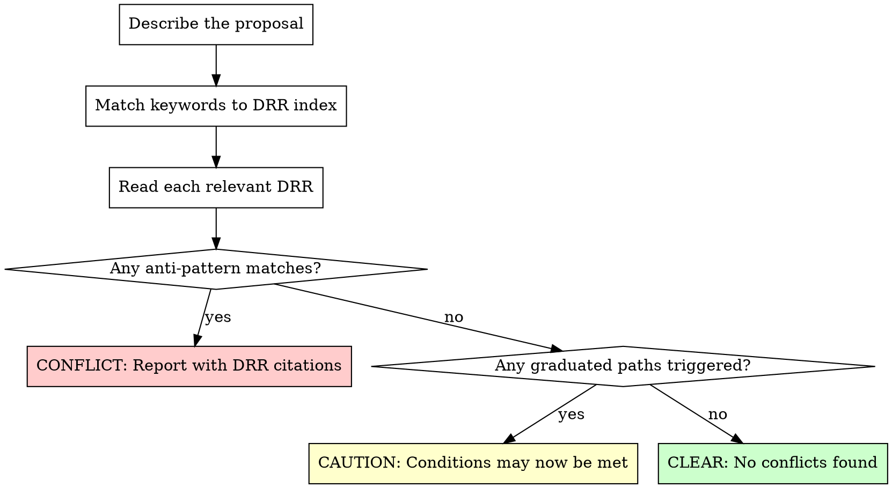

# Design Rationale Review

Review proposed features and code changes against KoNote's Design Rationale Records (DRRs) — expert-vetted architectural decisions that govern privacy, security, data modelling, and feature design. Prevents re-introducing designs that were already evaluated and rejected.

## When to Use

- A client, stakeholder, or developer proposes a new feature or integration
- A PR or code change touches areas governed by DRRs (auth, data access, AI, reporting, encryption, data export)
- Onboarding a new developer who needs to understand why things are designed a certain way
- Evaluating whether a "Parking Lot" feature is ready to build
- Someone asks "why can't we just...?" about an architectural constraint

## Workflow

### Step 1: Identify the Proposal

Get a clear description of what's being proposed. This can come from:
- The user's message (e.g., "a client wants a live API for participant data")
- A PR diff (e.g., code adding a new endpoint or model)
- A feature request or TODO item

If the proposal is vague, ask: "What data does this touch? Who initiates the action? Does it cross the boundary of a single KoNote instance?"

### Step 2: Find Relevant DRRs

Read `@.claude/skills/design-rationale/drr-index.md` and match the proposal's keywords to the topic index. Cast a wide net — a "webhook notification" proposal touches API, data export, AND privacy DRRs, not just the obvious one.

**Always start with the relevant Foundation Principle:**
- Participant-facing, note design, bilingual, or accessibility changes -> `foundation-collaborative-practice.md`
- Data sharing, cross-agency, community data, demographics -> `foundation-data-sovereignty.md`
- Auth, permissions, encryption, exports, logging -> `foundation-security-by-default.md`
- New dependencies, hosting, cost, deployment, evaluation -> `foundation-nonprofit-sustainability.md`

**Then check implementation-level DRRs:**
- Any data leaving a KoNote instance -> `no-live-api-individual-data.md`
- Any new permission or visibility logic -> `access-tiers.md`, `phipa-consent-enforcement.md`
- Any new entity or relationship type -> `circles-family-entity.md`, `fhir-informed-modelling.md`
- Any AI/LLM feature -> `ai-feature-toggles.md`, `self-hosted-llm-infrastructure.md`
- Any reporting or aggregate data -> `reporting-architecture.md`, `cids-privacy-architecture.md`
- Any infrastructure change -> `ovhcloud-deployment.md`, `data-access-residency-policy.md`

### Step 3: Read and Assess Each DRR

For each relevant DRR, read the full file from `tasks/design-rationale/` and check:

1. **Anti-Patterns section**: Does the proposal match any explicitly rejected design? Quote the specific anti-pattern.
2. **Expert Panel Findings**: What were the reasons for the current design? Do they still apply?
3. **Graduated Complexity Path**: Did the DRR say "reconsider when X happens"? Has X happened?
4. **Status**: Is this Decided (enforce), Draft (read but flexible), or Parking Lot (don't build)?

### Step 4: Produce the Review

Structure your output as follows:

---

**Proposal:** [one-line summary]

**DRRs Consulted:** [list of files read]

**Verdict:** CONFLICT / CAUTION / CLEAR

**Findings:**

For each relevant DRR:
- **[DRR name]** — [Conflict | Caution | Clear]
  - What the DRR says (quote the anti-pattern or decision)
  - How the proposal relates
  - What to do instead (if conflict)

**Recommendation:** [approve / modify / reject, with specific guidance]

---

## Review Depth by Context

| Context | Depth |
|---|---|
| Client feature request | Full review — check all keyword matches |
| PR code review | Targeted — focus on DRRs related to changed files |
| Quick "can we do X?" question | Index scan — cite the relevant DRR and its verdict |
| New developer onboarding | Explain the reasoning, not just the rule |

## Common Proposals and Their DRR Verdicts

These come up repeatedly. The answers are settled:

| Proposal | Verdict | Key DRR |
|---|---|---|
| Live API for individual PII | **Rejected** | `no-live-api-individual-data.md` |
| Webhook/push notifications with PII | **Rejected** | `no-live-api-individual-data.md` |
| Bidirectional CRM sync | **Rejected** | `no-live-api-individual-data.md` |
| FHIR server or FHIR API | **Rejected** | `fhir-informed-modelling.md` |
| Row-level multi-tenancy | **Rejected** | `multi-tenancy.md` |
| Per-agency LLM deployment | **Rejected** | `self-hosted-llm-infrastructure.md` |
| Person-to-person global relationships | **Rejected** | `circles-family-entity.md` |
| Executives seeing individual data in reports | **Rejected** | `reporting-architecture.md`, `access-tiers.md` |
| AI features accessing PII without toggle | **Rejected** | `ai-feature-toggles.md` |
| PWA for offline field work | **Rejected** | `offline-field-collection.md` |
| Translation as optional/toggleable | **Rejected** | `bilingual-requirements.md` |
| Hosting outside Canada | **Rejected** | `data-access-residency-policy.md` |
| English-only UI (no French) | **Rejected** | `foundation-collaborative-practice.md`, `bilingual-requirements.md` |
| Inaccessible portal features | **Rejected** | `foundation-collaborative-practice.md` |
| Cross-agency individual data combination | **Rejected** | `foundation-data-sovereignty.md`, `multi-tenancy.md` |
| Staff-initiated JSON/PDF export | **Approved** | `no-live-api-individual-data.md` |
| Aggregate cross-agency reporting | **Approved with constraints** | `cids-privacy-architecture.md` (k>=5) |
| FHIR-informed model naming | **Approved** | `fhir-informed-modelling.md` |

## When a DRR Needs Updating

If you find that:
- A "reconsider when" condition has been met
- New information invalidates the original reasoning
- A client need genuinely can't be met by the approved alternatives

**Do not override the DRR.** Instead:
1. Document the new evidence
2. Flag for GK (subject matter expert) review
3. If approved, update the DRR file before implementing the change
